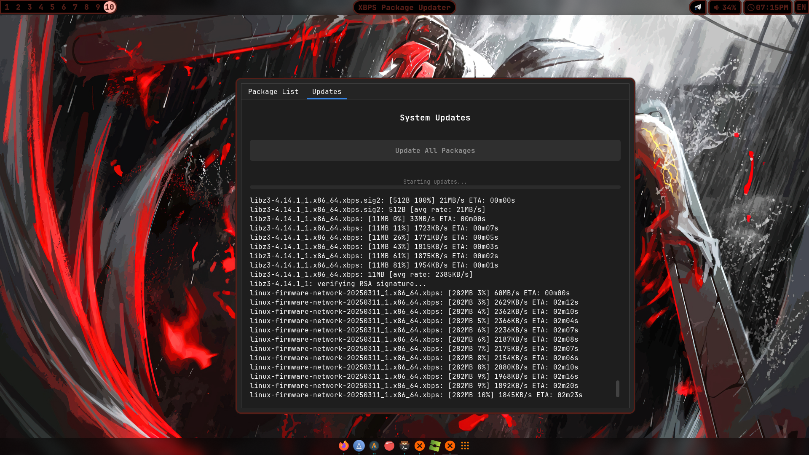
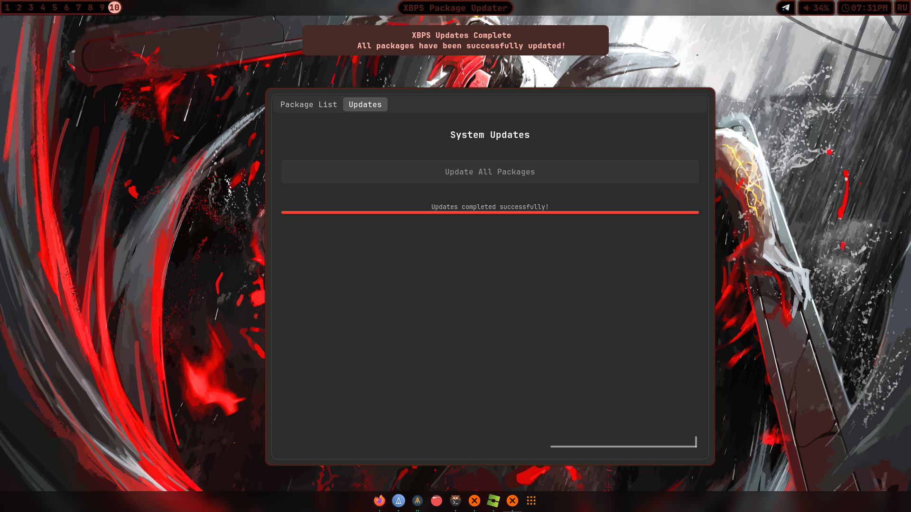

# XBPS UPDATER
Simple GTK UI for update system with XBPS **PACKAGE MANAGER** 

> on Arch Linux Might no work!
> because lack of my experience with XBPS only!

# INSTALL
to install:
```
git clone https://github.com/binarylinuxx/xbps_updater/tree/stable
cd xbps_updater/
sudo ./install.sh
```

> note:
> you can use unstable branch but im not recommend
> might be possible many bugs

# SCREENS
UPDATE PROCCES:


UPDATE FINISH:

