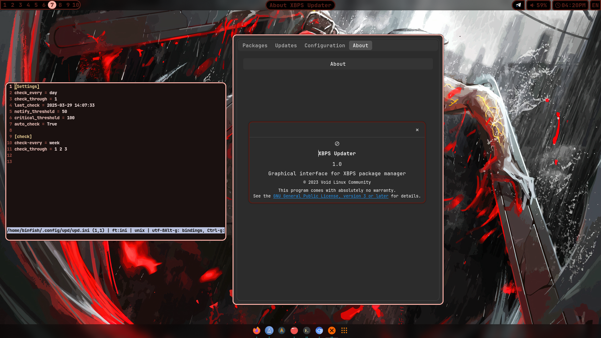
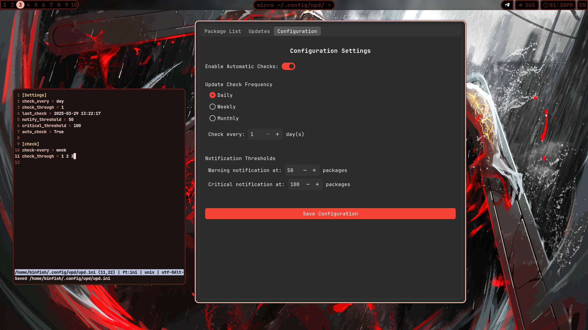

# XBPS UPDATER


Simple GTK UI for update system with XBPS **PACKAGE MANAGER** full python
im pretty lazy for even one command so... My gtk xbps update manager!

> the utility currenly only alpha 
> dont expect to no bugs to be found

# INSTALL
to install:
```
git clone https://github.com/binarylinuxx/xbps_updater/tree/stable
cd xbps_updater/
sudo ./install.sh
```

> note:
> you can use unstable branch but im not recommend
> might be possible many bugs

# LINKS
[INSTALL](https://github.com/binarylinuxx/xbps_updater#install)

[SCREENSHOTS](https://github.com/binarylinuxx/xbps_updater#screens)

[CONFIG](https://github.com/binarylinuxx/xbps_updater#configuration)

[CONFIG(MORE VERBOSED)](https://github.com/binarylinuxx/xbps_updater#auto-check)

[TO-DO](https://github.com/binarylinuxx/xbps_updater#in-feature)

# SCREENS
**HOME PAGE:**


**UPDATE PROCCES:**


**ABOUT PAGE**


# **CONFIGURATION:**


# AUTO CHECK
by default config auto-generated in ~/.config/xbps-updater/config.ini

configure auto check:
```
[Settings]
check_every = week|month|day
check_through = 2
notify_threshold = 150
critical_threshold = 200
auto_check = True
confirm_updates = True
use_sudo = False
last_check = 2025-08-06 14:02:52
```

# IN FEATURE
-- create xbps binary package []

-- submit the package to void repos []

-- full rewriten UI []
